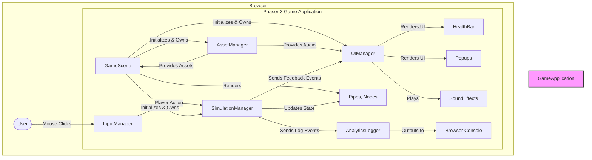
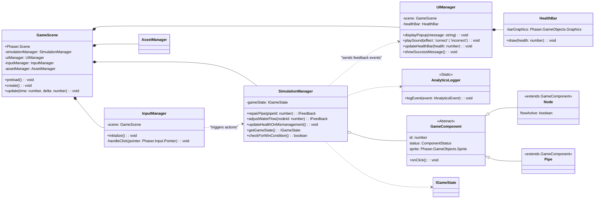

# Project

## Product Specification

### Introduction & Vision

This document outlines the requirements for a Minimum Viable Product \(MVP\) of an educational game about the San Francisco sewage system\.The product is a web\-based, single\-player simulation game designed to teach the general public the basic technical concepts of sewage system management\. The vision is to create an engaging, interactive experience where users learn organically by doing, rather than through passive instruction\. The game will present a simplified model of a sewage network, allowing players to experiment with repairs and water flow management in a consequence\-free environment\. The overall aesthetic will be friendly and approachable to make a complex topic accessible\.The primary goal of this MVP is to quickly build and validate the core concept of a simulation\-based learning game for this subject matter\.### Target Audience & User Personas
**Primary User:** The general public\.

**Assumed Knowledge:** A high school level education with no specific prior knowledge of civil engineering or sewage systems\.

**Motivation:** Curiosity and a desire to learn about municipal infrastructure through an interactive and playful medium\.

### User Stories / Use Cases

As a player, I want to see a visual representation of a sewage system so that I can understand its basic components\.

As a player, I want to be able to interact with the system by fixing broken parts and managing how water moves through it, so I can learn the cause\-and\-effect of system management\.

As a player, I want to receive immediate feedback on my actions, so I can understand whether my decisions are correct or incorrect\.

As a player, I want to see a visual indicator of the system's overall health, so I can understand the consequences of mismanagement over time\.

As a player, I want a clear, simple goal so that I know what I need to accomplish to "win" the simulation\.

As a player, I want the game to have a friendly and non\-intimidating visual style, so that I feel encouraged to explore and learn\.

### Functional Requirements

#### Core Simulation

The game will present a simplified simulation of a sewage network\.

The network shall consist of fewer than 10 interactive components \(pipes and nodes\)\.

The simulation will be presented as a free\-form experience, allowing the player to interact with the components without a guided tutorial\.

The simulation will have a clear win\-state\. The game is considered "won" when all pipes in the system have been repaired\.

Upon reaching the win\-state, the system must display a success message to the player\.

#### Player Interaction

Players must be able to interact with the system using a mouse\.

Players must be able to perform a "repair" action on damaged pipes\.

Players must be able to perform an "adjust water flow" action\.

"adjusting water flow" = Options: 1\. Players click on valves or nodes to toggle water flow on or off for a specific pipe section\. \(Pro: Simple binary interaction\. Con: Lacks nuance\)\.

#### System Feedback

##### Infrastructure Health

The simulation must include a concept of overall infrastructure health\.

Mismanagement of the system by the player must cause the infrastructure's health to deteriorate\.

"mismanagement" and trigger health deterioration: Health deteriorates over time for any pipe that remains in a "damaged" state\.

The system's health must be represented visually to the player\.

The health indicator must be a health bar that progressively changes color to reflect the current health status\.

health bar represents the entire system or individual components: A single, global health bar represents the health of the entire sewage network\. \(Pro: Simple and easy for the player to understand at a glance\. Con: Doesn't provide granular feedback\)\.

##### Action\-Based Feedback

The system must provide immediate feedback to the player after an action is performed\.

The system must provide feedback for both correct and incorrect actions\.

Feedback must be provided via a pop\-up notification on the screen\.

Define the content of the pop\-up notifications: Provide a brief educational hint, especially for incorrect actions \(e\.g\., "That flow adjustment will cause an overload\!"\)\. \(Pro: Reinforces learning\. Con: Requires more content creation\)\.

Feedback must be provided via a simple sound effect\.

There must be a distinct sound effect for a correct action and a different sound effect for an incorrect action\.

#### Analytics

The system shall incorporate minimal event logging for the purpose of future analysis\.

Events to be tracked include, at a minimum: repair actions and mismanagement events\.

### Non\-Functional Requirements \(Business Perspective\)

#### Usability

The game's visual style must be cartoonish and/or "cute" to be engaging and approachable for a general audience\.

The user interface must be simple and intuitive, relying on mouse\-based interactions that are easy to discover\.

The game should not require complex instructions; learning should occur organically through interaction\.

#### Reliability

As a web\-based application, the game should be consistently available to users\.

#### Performance

The game should load quickly and run smoothly in a standard web browser without requiring significant computing resources from the user's device\.

### Scope

#### In Scope

A single\-player, web\-based simulation game\.

Core mechanics: repairing pipes and adjusting water flows\.

A simplified network with fewer than 10 components\.

Feedback mechanisms: pop\-ups, sound effects, and a visual health bar\.

A single win condition \(all pipes repaired\) resulting in a success message\.

A cartoonish visual aesthetic\.

Minimal analytics logging\.

#### Out of Scope

Any historical or narrative\-based content about the SF sewage system\.

A complex, physics\-accurate simulation model\.

Player scoring, leaderboards, or achievements\.

A replay or restart game option after the success message is displayed\.

Multiple levels or progressively complex challenges\.

Any user account or login system\.

Mobile or desktop application versions\.

### Success Metrics

The primary success metric for this MVP is the successful delivery of a functional prototype that implements the core gameplay loop described in this document\.

The prototype is considered successful if a user can interact with the simulation, perform repairs, receive feedback, and reach the win state\.

### Assumptions & Dependencies

#### Assumptions

It is assumed that a simplified, non\-technical simulation is sufficient to achieve the educational goals for the target audience\.

It is assumed that a "cute" or "cartoonish" visual style will make the subject matter more engaging and less intimidating\.

It is assumed that users can learn the game's mechanics organically without an explicit tutorial\.

#### Dependencies

There are no external business dependencies for the creation of this MVP\. The project does not rely on specific municipal data or academic materials at this stage\.

## Technical Specification

### System Overview

This document provides the detailed technical specifications for the "SF Sewage System Learning Simulation MVP," a single\-player, web\-based educational game\. The purpose of this system is to teach the general public basic technical concepts of sewage system management through interactive simulation\. The game will be built as a monolithic client\-side application using the Phaser 3 HTML5 game framework with JavaScript/TypeScript\. The core gameplay loop involves players repairing damaged pipes and adjusting water flow in a simplified, visually engaging network, with immediate feedback provided for their actions\.The system is self\-contained and does not interact with any external systems, databases, or APIs\. All game state is managed in the client's browser for the duration of a single session\.### Architectural Drivers

#### Goals

**Rapid Development:** The primary goal is to deliver a functional MVP within a one\-day timeline\. The architecture and technology choices must support rapid prototyping and iteration\.

**Educational Effectiveness:** The simulation, though simplified, must effectively convey the cause\-and\-effect relationships of sewage system management\.

**User Engagement:** The system must be approachable and engaging for a non\-technical audience, achieved through a "cartoonish" aesthetic and immediate, clear feedback\.

**Maintainability:** The codebase should be structured logically to allow for future expansion beyond the MVP scope, promoting a clear separation of concerns\.

#### Constraints

**Technology Stack:** The application must be built using web technologies \(HTML5, CSS, JavaScript\) and the Phaser 3 game engine\.

**Platform:** The application must be browser\-based and runnable on standard modern web browsers\.

**Scope:** The MVP is strictly limited to the features defined in the PRD\. It must include fewer than 10 interactive components, a single success condition, and no replay or scoring mechanics\.

**Timeline:** The entire development cycle for the MVP is limited to approximately one day\.

**Data Persistence:** The application will not have a backend and will not persist any user or session data after the browser tab is closed\.

### High\-Level Architecture

A monolithic, client\-side architectural pattern is selected for this project\. This choice is optimal for a self\-contained, browser\-based game and aligns with the rapid development goal\. The entire application logic, rendering, and state management will be handled within a single codebase running in the user's browser\.The architecture will be structured around Phaser 3's scene\-based system\. Key responsibilities will be delegated to manager classes to maintain a clean separation of concerns\.**Game Scene:** The main Phaser scene that orchestrates the entire simulation\. It will be responsible for initializing the game world, updating the game state, and rendering all game objects\.

**Simulation Manager:** A logical component responsible for the core gameplay rules\. It manages the state of the sewage network \(e\.g\., pipe health, water flow\), processes player inputs, and determines the consequences of actions\.

**UI & Feedback Manager:** This component handles all user\-facing information display that is not part of the core simulation world\. This includes rendering the health bar, displaying pop\-up notifications, and triggering audio cues\.

**Asset Manager:** Responsible for pre\-loading all necessary game assets, including images \(sprites\) for pipes, nodes, and UI elements, as well as sound effect files\.

**Input Manager:** Captures and interprets raw user input \(mouse clicks\) and translates them into game\-specific actions to be processed by the Simulation Manager\.

**Analytics Logger:** A minimal, lightweight service that logs key game events \(e\.g\., `pipe_repaired`, `mismanagement_event`\) to the browser's console\.

#### Components Diagram



### Data Architecture and Models

The data architecture is entirely in\-memory and client\-side\. There is no database\. Data models will be enforced using TypeScript interfaces to ensure type safety and code clarity\.#### Data Storage Strategy
**Game State:** The complete state of the simulation \(component status, overall health, etc\.\) will be held in memory within the `SimulationManager`\. This state is ephemeral and is reset upon page reload\.

**Configuration:** Static game configuration, such as the network layout \(positions of pipes and nodes\), initial health, and damage parameters, will be stored in a separate JSON or JavaScript object file for easy modification\.

#### Data Models \(TypeScript Interfaces\)

These models define the core data structures for the simulation\.```typescript
/\*\*

- Represents the possible states of an interactive component.
  \*/
  export enum ComponentStatus {
  HEALTHY = 'healthy',
  DAMAGED = 'damaged'
  }

/\*\*

- Base interface for any interactive component in the simulation.
  \*/
  export interface IGameComponent {
  id: number;
  type: 'pipe' | 'node';
  status: ComponentStatus;
  sprite: Phaser.GameObjects.Sprite; // Reference to the visual object
  }

/\*\*

- Represents a pipe, which can be repaired.
  \*/
  export interface IPipe extends IGameComponent {
  type: 'pipe';
  }

/\*\*

- Represents a node or junction, which can control water flow.
  \*/
  export interface INode extends IGameComponent {
  type: 'node';
  // TODO: Define properties for water flow adjustment.
  // Options: 1. `flowActive: boolean;` (For simple on/off valve).
  // 2. `flowDirection: 'up' | 'down' | 'left' | 'right';` (For junction).
  // For the MVP, a simple boolean is recommended.
  flowActive: boolean;
  }

/\*\*

- Represents the overall state of the game session.
  \*/
  export interface IGameState {
  systemHealth: number; // A value from 0 to 100
  components: IGameComponent[];
  allPipesRepaired: boolean;
  }

/\*\*

- Represents a log entry for analytics.
  \*/
  export interface IAnalyticsEvent {
  timestamp: number;
  eventType: 'pipe_repaired' | 'mismanagement_error' | 'game_won';
  componentId?: number; // Optional: which component was involved
  details: string;
  }

/\*\*

- Defines the structure for a feedback message.
  \*/
  export interface IFeedback {
  message: string;
  soundEffect: 'correct' | 'incorrect';
  }

````

#### Conceptual Entity Relationship Diagram
This ERD illustrates the conceptual relationships between the main data entities, even though they are not persisted in a database\.```mermaid
erDiagram
    GAME_SESSION ||--|{ GAME_COMPONENT : "contains"
    GAME_SESSION {
        int systemHealth "Current health (0-100)"
        boolean allPipesRepaired "Win condition flag"
    }

    GAME_COMPONENT {
        int id PK "Unique component identifier"
        varchar type "'pipe' or 'node'"
        varchar status "'healthy' or 'damaged'"
    }

    GAME_COMPONENT ||--o{ ANALYTICS_EVENT : "generates"
    ANALYTICS_EVENT {
        datetime timestamp "Event timestamp"
        varchar eventType "Type of event (e.g., 'repair')"
        int componentId FK "Reference to component"
        varchar details "Event details"
    }

````

### Component Blueprint & Class Diagram

The internal object\-oriented structure of the application is designed to be modular and leverage Phaser 3's architecture\.#### Class Diagram



### User Interface / User Experience Key Requirements

#### General Look & Feel

**Aesthetic:** The visual style must be "cartoonish" and "cute\." This implies the use of bright, friendly colors, soft shapes, and non\-realistic representations of pipes and water\.

**Atmosphere:** The game should feel lighthearted and encouraging, not stressful or overly technical\.

**Accessibility:** Ensure sufficient color contrast, especially for the health bar's progressive color change\.

#### Key Screens / Views

The application consists of a single primary view or screen\.##### Main Simulation Screen
**Layout:** A static, 2D top\-down or side\-on view of the sewage network\. The network and its components are the central focus\.

**Background:** A simple, non\-distracting background that suggests an underground setting in a cartoon style\.

**Components:**

**Pipes & Nodes:** Fewer than 10 components, clearly distinguishable\. Damaged pipes should have a distinct visual state \(e\.g\., a crack sprite overlay, darker color\)\.

**Health Bar:** A single, global health bar will be prominently displayed at the top or bottom of the screen\. It must visually represent the `systemHealth` value from the `IGameState`\.

**Pop\-up Notifications:** These will appear overlaid on the center of the screen temporarily after a user action\. They should be modal in nature but disappear automatically after a short duration \(e\.g\., 1\.5 seconds\)\.

**Success Message:** A final, larger pop\-up that appears upon winning\. It should be clear and celebratory\.

#### Data Models \(UI\)

The UI will primarily visualize data from the `IGameState` and `IFeedback` interfaces defined in the Data Architecture section\. No new data models are required for the UI layer\.#### Data Presentation
**Health Bar:** The health bar must change color progressively\.

`$health &gt; 70$`: Green

`$30 &lt; health \leq 70$`: Yellow

`$health \leq 30$`: Red

**Pop\-ups:**

Text from `IFeedback.message`\.

Accompanied by sound from `IFeedback.soundEffect`\.

the content for pop\-up notifications\. Provide brief educational hints for incorrect actions, e\.g\., "That flow adjustment will cause an overload\!"\. \(Pro: Reinforces learning\. Con: Requires more content creation\)\.

#### Key Interaction Patterns

**Interaction Model:** Simple point\-and\-click\. No drag\-and\-drop, keyboard controls, or complex gestures are required for the MVP\.

**Repairing Pipes:** A single click on a `damaged` pipe sprite will trigger the repair action\. The cursor should change to a pointer when hovering over an interactive component\.

**Adjusting Water Flow:**

the specific click mechanism for "adjusting water flow"\. Options: 1\. Players click a node/valve, and it toggles between two states \(e\.g\., `open`/`closed`\), visually represented by a sprite change\. \(Pro: Very simple, clear binary interaction\. Con: Lacks nuance\)\.

**Error Feedback:** Clicking on a non\-interactive element or a healthy component should trigger the "incorrect" action feedback \(pop\-up and sound\)\.

#### UI Implementation Plan

The UI will be implemented using Phaser 3 Game Objects\.**Reusable Components:**

`HealthBar`: A class that encapsulates the logic for drawing and updating the health bar graphics based on a health value\.

`Popup`: A class or function that creates a temporary UI group \(background image, text object\) and manages its fade\-in/fade\-out animation\.

**Asset Requirements:**

`pipe_healthy.png`: Sprite for a healthy pipe section\.

`pipe_damaged.png`: Sprite for a damaged pipe section\.

`node_on.png`: Sprite for a node with water flow active\.

`node_off.png`: Sprite for a node with water flow inactive\.

`background.png`: Main game background image\.

`popup_background.png`: A generic background for notification pop\-ups\.

`correct.mp3`: Sound effect for successful actions\.

`incorrect.mp3`: Sound effect for errors or mismanagement\.

### Mathematical Specifications and Formulas

#### Infrastructure Health Calculation

The system's health is a numerical value between 0 and 100\. Deterioration is calculated based on mismanagement events\.**Initial Health:** `$Health_{initial} = 100$`

**Health Deterioration:** Health decreases when mismanagement occurs\.

`$Health_{new} = \max(0, Health_{old} - \Delta_{damage})$`

**Damage Value \(\*\***\\Delta\_\{damage\}\***\*\):**

what actions constitute "mismanagement" and their corresponding damage values: 2\. An immediate penalty `$d_a$` for every incorrect action \(e\.g\., clicking a healthy pipe\)\. \(Pro: Direct feedback for mistakes\. Con: Can be exploited or feel arbitrary\)\.

**Health Restoration:** Repairing a pipe should restore a small amount of health to reward progress\.

`$Health_{new} = \min(100, Health_{old} + \Delta_{repair})$`

A fixed value of `$\Delta_{repair} = 10$` per successful repair is recommended\.

#### Performance Requirements

**Frame Rate:** The simulation must maintain a consistent frame rate\. `$FPS \geq 30$` on a standard desktop browser\.

**Load Time:** Initial asset loading and game initialization should be fast\. `$T_{load} &lt; 5s$` on a standard broadband connection\.

### DEVOPS Requirements

#### Deployment

**Process:** The application consists of static files \(HTML, CSS, JS, assets\)\. Deployment will involve copying these files to a static web hosting provider\.

**Hosting:** Recommended providers include GitHub Pages, Vercel, or Netlify, all of which offer simple, free\-tier hosting for static sites\.

**Build Step:** A simple build step may be required if using TypeScript, involving transpiling `.ts` files to `.js`\. This can be automated with a `package.json` script \(e\.g\., `npm run build`\)\.

#### Configuration

**Environment:** There is only one environment \(production\)\.

**Game Configuration:** Core game parameters \(e\.g\., initial health, damage values, network layout\) will be stored in a `config.json` file\. This file will be loaded by Phaser at startup\. This approach allows for tweaking the game's difficulty and layout without changing the source code\.

#### Monitoring

**Strategy:** Monitoring for the MVP will be minimal and manual\.

**Logging:** The `AnalyticsLogger` will output key events to the browser's developer console \(`console.log`\)\. This provides basic insight into player actions during development and playtesting\. No remote logging service will be integrated for the MVP\.

### Implementation, Validation and Verification Strategy

#### Implementation Approach \(Risk\-First\)

The implementation will proceed in logical, testable stages to de\-risk the project early and ensure a functional core is established quickly\.**Project Setup:** Initialize a new Phaser 3 project using a standard template \(e\.g\., with Webpack or Vite\)\. If using TypeScript, configure `tsconfig.json`\.

**Asset Loading:** Create a preloader scene to load all required image and audio assets\. This de\-risks issues related to asset paths and formats\.

**Static Scene Rendering:** Create the main `GameScene`\. Render the static background and the sewage network components \(pipes, nodes\) in their initial state based on the `config.json` file\.

**Core Interaction:** Implement the `InputManager` to detect clicks on game components\. Add visual feedback for hover and click states \(e\.g\., tinting the sprite\)\.

**State Management:** Implement the `SimulationManager` and the core `IGameState`\. Connect the input manager so that clicking a damaged pipe updates its status in the game state\.

**Health Logic:** Implement the health bar UI and the mathematical formulas for health deterioration and restoration\. Link this to actions in the `SimulationManager`\.

**Feedback System:** Implement the `UIManager` to display pop\-up messages and play sound effects based on feedback events from the `SimulationManager`\.

**Win Condition:** Add the logic to the `SimulationManager` to check if all pipes are repaired after each successful action\. When true, trigger the `showSuccessMessage` method in the `UIManager`\.

**Logging:** Integrate the `AnalyticsLogger` calls within the `SimulationManager` at key points \(repair, error, win\)\.

**Deployment:** Deploy the final static files to the chosen hosting provider\.

#### Validation and Verification

**Unit Testing:** While formal unit tests are out of scope for a 1\-day MVP, each manager class should be written with clear inputs and outputs, allowing for easy manual testing by calling its methods from the browser console\.

**Integration Testing:** Will be performed manually by playing the game\. The test plan involves verifying each user story:

Can the player see the network?

Can the player click a damaged pipe to repair it?

Does the pipe's visual state change upon repair?

Do the correct pop\-up and sound occur for correct/incorrect actions?

Does the health bar decrease on mismanagement?

Does the health bar increase on repair?

Does the success message appear when all pipes are repaired?

**Cross\-Browser Testing:** Manually verify that the game runs correctly on the latest versions of Google Chrome and Mozilla Firefox\.
